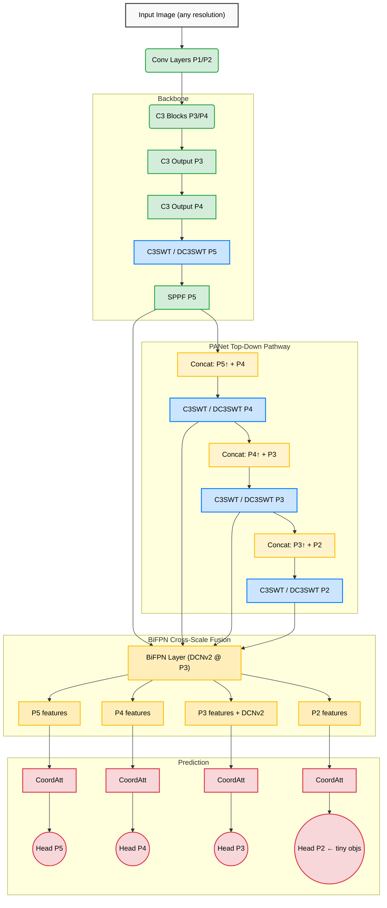

<div align="center">
  <h1>🦅 DASwin-YOLO: Deformable Attention Swin Transformer YOLOv5</h1>
  <p>
    A novel object detection architecture built on YOLOv5, combining<br>
    <strong>Multi-Scale Deformable Attention (DC3SWT)</strong> · <strong>BiFPN with DCNv2</strong> · <strong>Coordinate Attention</strong> · <strong>4-Scale Detection (P2–P5)</strong><br>
    Optimized for dense, high-resolution imagery and small-object detection. Generalized for any dataset.
  </p>
</div>

## 📌 Overview

This repository implements **DASwin-YOLO** (Deformable Attention Swin YOLO), a novel small-object detection architecture that takes inspiration from **"Swin-Transformer-Based YOLOv5 for Small-Object Detection in Remote Sensing Images"** *(Sensors 2023, 23, 3634)* and extends it with a principled architectural improvement.

The core contribution is **DC3SWT** — replacing fixed-window Swin Transformer attention (W-MSA + SW-MSA) with **Multi-Scale Deformable Attention (MSDA)**, making the network adaptive to object location and scale by design rather than relying on spatial window boundaries.

---

## 🔬 DASwin-YOLO — Core Architectural Contribution

> **DC3SWT — Deformable C3 Swin Transformer Block** (`models/dc3swt.py`)
> `DC3SWT: deformable attention replaces W-MSA+SW-MSA, see arxiv:2010.04159`

### The Problem with Fixed-Window Attention

The standard Swin Transformer block (used in `C3SWT`) partitions feature maps into fixed spatial windows (e.g. 8×8) and computes multi-head self-attention **only within each window**. This assumption breaks in remote sensing imagery where:

- Small objects rarely align with pre-defined window boundaries
- Dense clusters span multiple windows simultaneously
- Objects appear at arbitrary locations and scales, not aligned to any grid

### The DC3SWT Solution

DC3SWT replaces the entire W-MSA + SW-MSA mechanism with **Multi-Scale Deformable Attention (MSDA)** from Deformable DETR *(Zhu et al. 2020, arxiv:2010.04159)*.

For each query location, the network *learns where to look* by predicting **M×K sampling offsets** — allowing attention to span any spatial position on the feature map, regardless of window boundaries.

```
For each query position q at (x_q, y_q):
  1. Reference point  p_q = (x_q/W, y_q/H)           ← normalized [0,1] grid
  2. Predict offsets  Δp_{mk} ∈ (−0.5, 0.5)           ← learned via tanh clamp
  3. Sample value     v at (p_q + Δp_{mk})             ← F.grid_sample (bilinear)
  4. Attend          out = Σ_m Σ_k A_{mk} · v_{mk}    ← softmax weights over K
  5. Project          output = W_o · out
```

**Pure PyTorch — no custom CUDA extensions** (implemented via `F.grid_sample`).

### Design Constraints (All Satisfied)

| # | Constraint | Implementation |
|---|---|---|
| 1 | No custom CUDA | `F.grid_sample` bilinear sampling |
| 2 | Identical I/O shape to `C3SWT` | Same `(B,C,H,W)` in/out — drop-in at every YAML call site |
| 3 | `n_heads = max(1, c_ // 32)` divides `d_model` | Verified for all YOLOv5s widths: c_∈{32,64,128,256,512} |
| 4 | `H*W < n_points` edge case | `n_pts = min(n_points, H*W)` clamped at runtime |
| 5 | Paper traceability | `# DC3SWT: deformable attention replaces W-MSA+SW-MSA, see arxiv:2010.04159` on every block |

### C3SWT vs DC3SWT

| Property | C3SWT (baseline) | DC3SWT (proposed) |
|---|---|---|
| Attention type | W-MSA + SW-MSA (fixed windows) | MSDA (learned offsets) |
| Window boundary handling | Split → shifted windows | Implicit via offset prediction |
| Non-square inputs | Requires padding to window multiple | Native — no padding needed |
| Small feature maps | Clamp window to min(H,W) | Clamp n_points to H*W |
| Custom CUDA | No | No |
| Parameters (YOLOv5s) | 6.28M | 5.53M (−12%) |
| YAML config | `yolov5s_swint.yaml` | `yolov5s_dc3swt.yaml` |

---

## 🏛️ Design Decisions & Justifications

### 1. Why DCNv2 at P3 only — not P4 or P5?

The BiFPN bottom-up pathway processes fusion nodes in order P2 → **P3** → P4 → P5. DCNv2 is placed **exclusively at the P3 output node** for three compounding reasons:

**① P3 is the max-information-density junction**

P3_out is the only node in BiFPN that simultaneously receives input from **three distinct spatial paths**:
```
P3_out = conv(  w₁·P3_original        ← lateral skip from backbone
              + w₂·P3_td              ← top-down signal from P4/P5 context
              + w₃·P2_out_downsampled ← bottom-up signal from high-res P2  )
```
These three tensors originate from different receptive fields and sampling geometries. A rigid 3×3 kernel cannot align feature grids from paths with such different spatial histories. DCNv2's learned offset map corrects this misalignment adaptively.

By contrast, P4_out and P5_out merge 3 and 2 inputs respectively, but at half/quarter the spatial resolution — the geometric misalignment is proportionally smaller relative to the receptive field.

**② P3 is the primary detection scale for small objects**

In the 4-scale head (P2/P3/P4/P5), P3 at stride 8 is responsible for objects in the **~16–48 px range** — exactly where dense remote-sensing symbols, small vehicles, and ships concentrate. Feature misalignment at P3 directly degrades mAP for these classes. P4 (stride 16) handles 48–128px objects and P5 handles larger ones, where standard convolutions already achieve adequate spatial alignment.

**③ Cost vs. benefit**

Each `DeformConvBlock` adds 3 extra convolution layers (offset predictor, mask predictor, DCN) ≈ **+150K parameters** per level. At P4 resolution (~2× smaller), the alignment benefit approximately halves while the cost remains constant. At P5 the benefit is negligible. Placing DCNv2 at just P3 gives:

| Level | Spatial res (1024px in) | Alignment benefit | Cost | Decision |
|---|---|---|---|---|
| P2 | 256×256 | Low — P2 has only 2 inputs | +150K | ❌ Skip |
| **P3** | **128×128** | **Highest — 3-way junction, small-obj scale** | **+150K** | **✅ DCNv2** |
| P4 | 64×64 | Medium — diminishing returns | +150K | ❌ Skip |
| P5 | 32×32 | Low — coarse resolution, large objects | +150K | ❌ Skip |

> Authoritative docstring: [`models/bifpn.py` — `BiFPNLayer` class](models/bifpn.py)

---

### 2. Why single-level MSDA in DC3SWT — not multi-level like Deformable DETR?

Deformable DETR's MSDA operates across **L=4 feature levels simultaneously** because the decoder needs global cross-scale context. DC3SWT operates **within** a single feature pyramid level (L=1) for two reasons:

- **Local context is sufficient**: Inside a backbone/neck block, the surrounding BiFPN already handles cross-scale aggregation. Attending across levels inside DC3SWT would duplicate BiFPN's role.
- **Memory efficiency**: Multi-level sampling requires concatenating all feature maps, multiplying memory by L. Single-level MSDA keeps the per-block memory budget identical to C3SWT.

The "multi-scale" in the DC3SWT name refers to the **multi-point sampling** (M heads × K points) within a single level — not to attending across multiple feature scales.

---

## ✨ Key Architectural Enhancements

SwinYOLO improves upon the baseline YOLOv5s architecture through six fundamental modifications:

1. **CIOU K-Means Anchoring**: Upgraded initial bounding box clustering using Complete-IOU (CIOU) instead of standard Euclidean distance. Factors in aspect-ratio scaling for dataset-specific anchors.
2. **C3SWT / DC3SWT Backbone**: Deep feature extraction via CSP-wrapped Swin Transformer blocks with full LayerNorm (norm1/norm2), MLP dropout=0.1, DropPath=0.1, and Dropout2d=0.05. `DC3SWT` replaces fixed windows with learned deformable attention (see above).
3. **BiFPN Cross-Scale Fusion (PANet + BiFPN Neck)**: Top-down PANet pathway generates multi-scale features, fused via EfficientDet's fast normalized BiFPN with learnable scale weights. DCNv2 deformable convolutions applied at P3 for improved spatial alignment.
4. **Coordinate Attention (CA)**: `CoordAttMulti` applies per-scale Coordinate Attention adjacent to detection heads, injecting spatial position information along both X and Y axes independently.
5. **4-Tier Detection Head (P2–P5)**: Augments the standard 3-scale architecture with an ultra-high-resolution P2 head exclusively for microscopic/tiny objects.
6. **Deformable Conv v2 (DCNv2)**: Integrated inside the BiFPN neck at the P3 scale for improved receptive field adaptability on irregular objects.

---

## 🏗️ Architecture Flow Diagram



---

## 📊 Ablation Table

Swap configs to reproduce each row:

| Variant | Config | Attention Type | Params | Size (fp32) | Notes |
|---|---|---|---|---|---|
| Baseline YOLOv5s | stock | C3 bottleneck | ~7.0M | ~26.6 MB | Standard YOLOv5s |
| + C3SWT | `yolov5s_swint.yaml` | W-MSA + SW-MSA | **6.39M** | **24.4 MB** | Fixed-window Swin |
| **DASwin-YOLO** | `yolov5s_dc3swt.yaml` | **MSDA (learned offsets)** | **5.64M** | **21.5 MB** | **This work** |
| Full DASwin-YOLO | `yolov5s_dc3swt.yaml` | DC3SWT + BiFPN DCN + CoordAtt | 5.64M | 21.5 MB | All components |

> **fp16 inference**: halves memory → DASwin-YOLO fits in **~10.7 MB** at fp16.  
> **1024×1024 input**: FLOPs scale by ~2.56× vs 640×640.  
> Counts at `nc=80`, `width_multiple=0.50`.

---

## 🚀 Quickstart Guide

### 0. Install dependencies

```bash
pip install -r requirements.txt
# Key additions: timm>=0.9.0 (Swin utilities), torchvision>=0.13.0 (DCNv2)
```

### 1. Prepare your dataset

Copy and fill in the dataset template:

```bash
cp data/swinyolo_example.yaml data/my_dataset.yaml
# Edit data/my_dataset.yaml — set path, train, val, nc, names
```

### 2. Generate dataset-specific anchors (strongly recommended)

```bash
python utils/ciou_kmeans.py \
    --label-dir /path/to/your/labels \
    --img-size 1024 \
    --n-clusters 12

# Paste the printed anchors into models/yolov5s_swint.yaml or yolov5s_dc3swt.yaml
```

### 3. Train — C3SWT baseline (paper reproduction)

```bash
python train_swinyolo.py \
    --data data/my_dataset.yaml \
    --cfg models/yolov5s_swint.yaml
```

### 4. Train — DC3SWT variant (this work, recommended)

```bash
python train_swinyolo.py \
    --data data/my_dataset.yaml \
    --cfg models/yolov5s_dc3swt.yaml
# DC3SWT: deformable attention replaces W-MSA+SW-MSA, see arxiv:2010.04159
```

### 5. Full CLI options

```bash
python train_swinyolo.py --help

# Common overrides:
python train_swinyolo.py \
    --data data/my_dataset.yaml \
    --cfg models/yolov5s_dc3swt.yaml \
    --epochs 150 \
    --batch-size 8 \
    --img-size 640 \
    --scheduler cosine \
    --device 0
```

### 6. Verify all components pass tests

```bash
# From repo root — no pytest required
python tests/test_components.py

# Expected: 36/36 passed — All tests passed! ✅
```

---

## 🧪 V4 Training Hardening

All applied automatically via `train_swinyolo.py`:

| Feature | Detail |
|---|---|
| **AdamW @ lr=1e-6** | Prevents Swin block gradient spike at epoch ~10 |
| **ValLoss Early Stopping** | Stops on validation loss (more stable than mAP on dense datasets) |
| **NaN loss guard** | Skips non-finite batches to protect optimizer momentum buffers |
| **Gradient clip** | `max_norm=1.0` — standard for Transformer-based models |
| **Close-mosaic** | Disables heavy augmentation for final N epochs (YOLOv8 trick) |
| **Cosine LR + DropPath=0.1** | Smooth convergence for Swin Transformer training |
| **DETR-style logger** | Per-batch log with ETA and loss breakdown → `training_log.txt` |

---

## 📂 Core Component Locations

| File | Purpose |
|---|---|
| `models/yolov5s_swint.yaml` | C3SWT architecture config (baseline) |
| `models/yolov5s_dc3swt.yaml` | **DC3SWT architecture config (proposed)** |
| `models/swin_block.py` | `C3SWT` — CSP + Swin window attention (W-MSA + SW-MSA) |
| `models/dc3swt.py` | **`DC3SWT` + `MSDABlock`** — pure-PyTorch deformable attention |
| `models/bifpn.py` | `BiFPNLayer` — fast normalized BiFPN with DCNv2 @ P3 |
| `models/coord_attention.py` | `CoordAtt` + `CoordAttMulti` — Coordinate Attention |
| `utils/ciou_kmeans.py` | CIOU anchor clustering for dataset-specific anchors |
| `train_swinyolo.py` | One-shot training launcher (cross-platform, dataset-agnostic) |
| `data/swinyolo_example.yaml` | Dataset template — copy and fill for your data |
| `tests/test_components.py` | 36-test component suite (standalone, no pytest needed) |

---

## 📖 References

- **Paper**: Gong, H. et al. *Swin-Transformer-Based YOLOv5 for Small-Object Detection in Remote Sensing Images.* Sensors 2023, 23, 3634. [DOI:10.3390/s23073634](https://doi.org/10.3390/s23073634)
- **Deformable DETR**: Zhu, X. et al. *Deformable DETR: Deformable Transformers for End-to-End Object Detection.* ICLR 2021. [arxiv:2010.04159](https://arxiv.org/abs/2010.04159)
- **Swin Transformer**: Liu, Z. et al. *Swin Transformer: Hierarchical Vision Transformer using Shifted Windows.* ICCV 2021.
- **BiFPN / EfficientDet**: Tan, M. et al. *EfficientDet: Scalable and Efficient Object Detection.* CVPR 2020.
- **Coordinate Attention**: Hou, Q. et al. *Coordinate Attention for Efficient Mobile Network Design.* CVPR 2021.
- **YOLOv5**: Jocher, G. et al. Ultralytics YOLOv5. [github.com/ultralytics/yolov5](https://github.com/ultralytics/yolov5)
